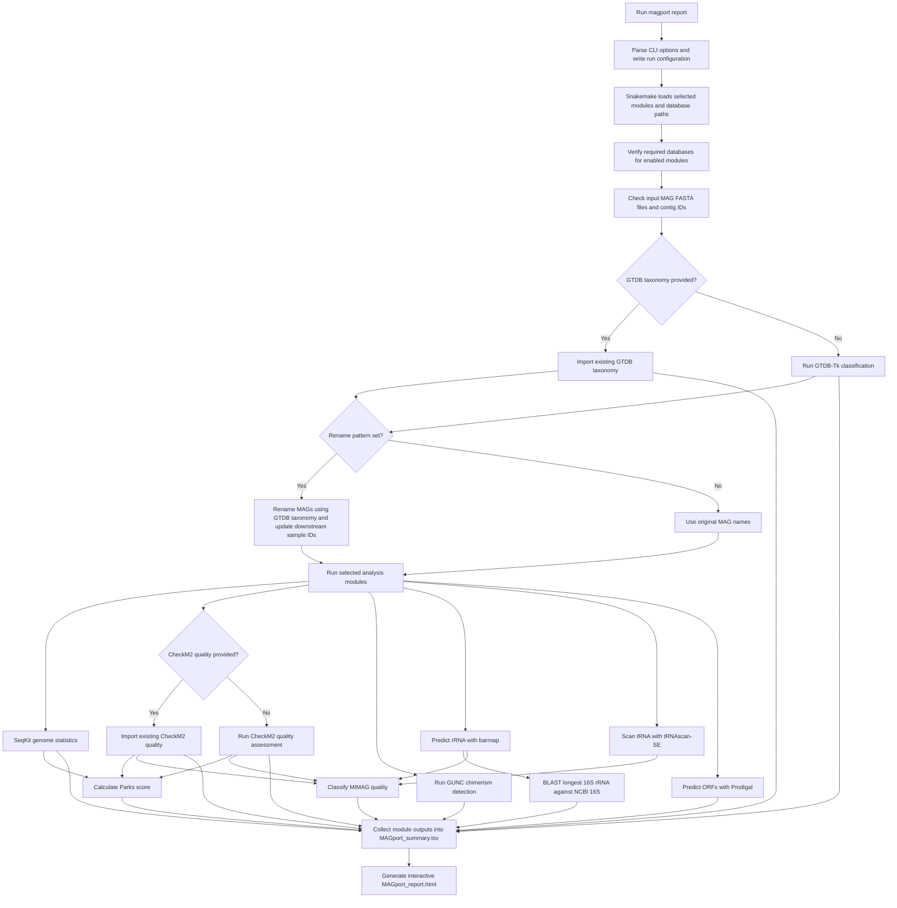

# MAGport 🧬

[](https://opensource.org/licenses/MIT)

A Snakemake pipeline for comprehensive characterization of Metagenome-Assembled Genomes (MAGs).


## 🔍 Overview

MAGport is a modular workflow that provides:

1. Basic genome statistics (SeqKit)
2. Gene prediction (Prodigal)
3. Quality assessment (CheckM2)
4. Chimerism detection (GUNC)
5. rRNA prediction (barrnap)
6. tRNA scanning (tRNAscan-SE)
7. Taxonomic classification (GTDB-Tk)
8. 16S-based taxonomy (BLAST)
9. Park score calculation
10. MIMAG quality classification

**Outputs:** Interactive HTML report and consolidated TSV summary.

## 🚀 Quick Start

### Installation

```bash
git clone https://github.com/SilentGene/MAGport.git
cd MAGport
conda env create -f magport.yaml
conda activate magport
```

### Basic Usage

```PowerShell
$ magport report --help

 Usage: magport report [OPTIONS]

 Run MAGport Snakemake workflow.

╭─ Options ──────────────
│ *  --input_dir       -i      TEXT     Directory with MAG FASTA files [required]
│ *  --output_dir      -o      TEXT     Output directory [required]
│    --file_extension  -e      TEXT     FASTA extension (e.g. .fa,.fna,.fasta) [default: .fasta]
│    --threads         -t      INTEGER  Max threads [default: 8]
│    --modules                 TEXT     Comma-separated modules to run [default: stats,quality,park,gunc,rrna,trna,orfs,gtdb,rrna16S,mimag]
│    --force_rerun     -f               Force re-execution
│    --conda-prefix            TEXT     Directory to store Conda environments [default: /home/lin92/.snakemake/conda]
│    --rename_pattern          TEXT     Pattern to rename genomes, e.g. MyProject_[phylum5]_[increnum]
│    --input_taxonomy          TEXT     Existing GTDB taxonomy TSV to use instead of running GTDB-Tk
│    --gtdb_version            TEXT     GTDB release/version for --input_taxonomy, e.g. R232
│    --input_quality           TEXT     Existing CheckM2 quality TSV to use instead of running CheckM2
│    --snake_args              TEXT     Extra Snakemake args, e.g. --snake_args '--unlock'
│    --help                             Show this message and exit.
╰────────────────────────
```

Run the pipeline:
```bash
magport report --input_dir <mags_dir> \
        --output_dir <results_dir> \
        --threads 16 \
        --file_extension .fa
```

Start with a dry run to test:
```bash
magport report -i <mags_dir> -o <results_dir> --threads 4 --snake_args "-n"
```

### Dynamic MAG Renaming

I’m sure you’ve been frustrated by how messy MAG names can get. Now, you can use the `--rename_pattern` option to give your MAGs clean, consistent names. When specified, MAGport will dynamically rename the genomes after the GTDB-Tk classification step, and all downstream analysis will be performed on the newly named genomes.

The pattern string must contain the `[increnum]` placeholder for an incremental index, and can optionally include taxonomic level placeholders like `[taxonomy_levelX]`, where `taxonomy_level` can be `domain`, `phylum`, `class`, `order`, `family`, `genus`, or `species`, and `X` is an optional number specifying the maximum number of characters to extract.

For example, using `--rename_pattern "soil5cm_[phylum5]_[increnum]"`:
- A MAG classified under the phylum *Halobacteriota* would be renamed to something like `soil5cm_Halob_1`.
- If the phylum classification is missing, it will use a placeholder like `novP`.
- If a MAG is classified as "Unclassified Bacteria" or "Unclassified Archaea", the taxonomic placeholders will be replaced with `UncBac` or `UncArc` respectively.

```bash
magport report --input_dir <mags_dir> --output_dir <results_dir> --rename_pattern "MyProject_[phylum5]_[increnum]"
```

### Providing Existing GTDB Taxonomy and CheckM2 Quality Information

If you already have GTDB taxonomy classifications or CheckM2 quality assessments for your MAGs, you can skip those steps in the pipeline and provide the existing data directly. This can save time and computational resources.
To use existing GTDB taxonomy classifications, prepare a TSV file with the following format:

```genome    taxonomy
MAG_001       d__Bacteria; p__Proteobacteria; c__Gammaproteobacteria; o__Enterobacterales; f__Enterobacteriaceae; g__Escherichia; s__Escherichia coli
MAG_002       d__Bacteria; p__Firmicutes; c__Clostridia; o__Clostridiales; f__Clostridiaceae; g__Clostridium; s__Clostridium difficile
```

Then, run the pipeline with the `--input_taxonomy` option:

```bash
magport report --input_dir <mags_dir> --output_dir <results_dir> --input_taxonomy existing_taxonomy.tsv --gtdb_version R232
```
To use existing CheckM2 quality assessments, prepare a TSV file with the following format:

```genome    completeness    contamination
MAG_001       95.0           2.0
MAG_002       85.0           5.0
```

Then, run the pipeline with the `--input_quality` option:

```bash
magport report --input_dir <mags_dir> --output_dir <results_dir> --input_quality existing_quality.tsv
```


## 📦 Modules

Select specific modules with `--modules` (comma-separated):

| Category | Modules |
|----------|---------|
| Stats    | `stats` |
| Quality  | `quality`, `park`, `gunc`, `mimag` |
| Features | `rrna`, `trna`, `orfs` |
| Taxonomy | `gtdb`, `rrna16S` |

Default: All modules enabled.

## 🗄️ Database Configuration

### Required Databases

- **CheckM2**: For genome quality assessment
- **GUNC**: For chimerism detection
- **GTDB-Tk**: For taxonomic classification
- **NCBI 16S**: For 16S rRNA-based taxonomy

### Configuration Methods

`MAGport` requires several databases described above. If you already have these databases, you can specify their paths using either of the following methods:

1. **Set it and forget it** (recommended):
   ```bash
   magport db-config --checkm2 /path/to/checkm2_db \
                    --gunc /path/to/gunc_db \
                    --gtdb /path/to/gtdbtk_db \
                    --ncbi16s /path/to/ncbi_16s
   ```
   This command modifies the default configuration file located at `MAGport/config/config.yaml`, and the specified paths will be used for all future runs.

2. Manually edit the YAML config file
   You can find it at `MAGport/config/config.yaml`:
   ```yaml
   # Database paths (absolute paths recommended)
   checkm2_db_dir: "/path/to/checkm2_db"
   gunc_db_dir: "/path/to/gunc_db"
   gtdbtk_db_dir: "/path/to/gtdbtk_db"
   ncbi16s_dir: "/path/to/ncbi_16s"
   ```

3. Database configuration via Environment Variables

After downloading the databases, you can set database paths using environment variables:
```bash
export CHECKM2_DB_PATH="/path/to/checkm2_db"
export GUNC_DB_PATH="/path/to/gunc_db"
export GTDBTK_DB_PATH="/path/to/gtdbtk_db"
export NCBI16S_DB_PATH="/path/to/ncbi_16s"
```

4. Using command line during execution
   You can override database paths for a single run using `--snake_args`. I don't see why you would want to do this unless you have multiple versions of a database, but here it is:
   ```bash
   magport ... --snake_args "--config checkm2_db_dir=/path/to/checkm2_db"
   ```

### Database Download

If you don't have the required databases, `MAGport` can help you download and set them up.

#### Easy Setup: Using the Download Command

```bash
# Download all databases to specific locations
magport db-download \
  --gtdb-path /path/to/gtdb/ \
  --checkm2-db-path /path/to/checkm2db/ \
  --gunc-path /path/to/gunc/ \
  --ncbi16s-path /path/to/ncbi16s/

# Or download specific databases
magport db-download --gtdb-path /opt/db/gtdb/
```

> [!NOTE]
> While MAGport can download multiple databases using a single command, it is advisable to download each database separately to avoid potential issues with network interruptions or timeouts.

#### Manual Database download

```bash
# CheckM2
checkm2 database --download --path /path/to/checkm2_db

# GUNC
gunc download_db -d /path/to/gunc_db

# GTDB
wget https://data.gtdb.ecogenomic.org/releases/release220/220.0/auxillary_files/gtdbtk_package/full_package/gtdbtk_r220_data.tar.gz
tar -xzf gtdbtk_r220_data.tar.gz -C /path/to/gtdbtk_db

# NCBI 16S
wget "https://ftp.ncbi.nlm.nih.gov/blast/db/16S_ribosomal_RNA.tar.gz"
tar -xzf 16S_ribosomal_RNA.tar.gz -C /path/to/ncbi_16s
```

### Database Verification

The pipeline automatically verifies database integrity before each running.

If a database is missing or invalid, you'll receive notifications with specific instructions on how to configure it.

To verify your database configuration without running the pipeline:
```bash
# Do a dry run with verbose output
magport report -i test/mags -o test/output --snake_args "-n -p"

# Check current configuration
magport db-check
```

## 📊 Outputs

```
results/
├── MAGport_report.html    # Interactive visualization
├── MAGport_summary.tsv    # Consolidated results
├── 01_stats/             # Basic statistics
│   └── seqkit/           # Genome statistics (length, GC%, etc.)
├── 02_genes/             # Gene predictions
│   ├── orfs/            # Predicted protein-coding genes
│   ├── rrna/            # Predicted rRNAs
│   └── trna/            # Predicted tRNAs
├── 03_quality/           # Quality assessment
│   ├── checkm/          # CheckM2 results
│   ├── gunc/            # Chimerism detection
│   ├── parks_score/     # Parks quality score (reduced)
│   └── mimag/           # MIMAG compliance report
├── 04_taxonomy/          # Taxonomic classification
│   ├── gtdbtk/          # GTDB-Tk results
│   └── 16S/             # 16S rRNA-based taxonomy
└── logs/                # Runtime logs
```

## 🔄 Workflow



## 📝 Notes

- First run creates Conda environments under `~/.snakemake/conda/` or the path specified by `--conda-prefix`
- As GTDB-tk usually consume a lot of resources, we recommend using specs: CPU >= 16, RAM >= 140 GB

...🧙‍♂️🧬